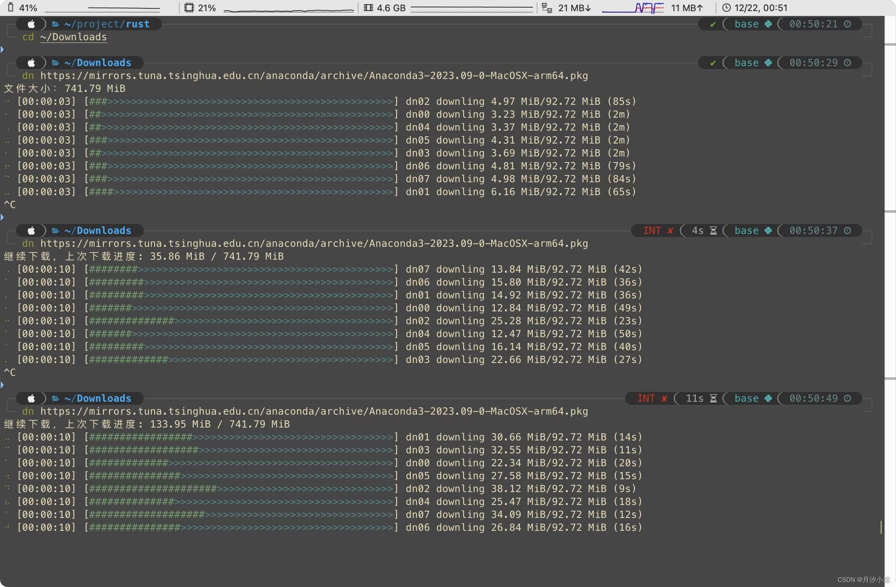

# 多线程下载器 (dn)

## 简介

这是一个使用 Rust 编写的多线程下载工具，支持断点下载和重试功能。通过该工具，你可以高效地下载文件，充分利用多线程提升下载速度，同时在下载过程中支持断点续传，保证下载的稳定性和可靠性。

## 特性

- **多线程下载：** 利用多线程技术，加速文件下载过程。
- **断点下载：** 支持下载过程中的断点续传，避免因网络问题导致的下载失败。
- **自定义线程数：** 可以通过命令行参数自定义线程数量，根据网络情况选择合适的线程数以提高下载效率。
- **重试机制：** 在下载失败的情况下，支持设定重试次数，提高下载成功的概率。
- **简单易用：** 使用简单的命令行参数，轻松启动下载任务。

## 安装

首先，确保你已经安装了 Rust 环境。然后通过以下步骤安装下载器：

```bash
cargo install dn
```

## 用法

```bash
dn [OPTIONS] <URL>
```


### 参数说明

- `<URL>`: 要下载文件的 URL。
- `-o, --output <OUTPUT>`: 指定输出文件路径。
- `-H, --header <HEADER>`: header 路径，自动检测并导入当前路径下的 header, header.dn, header.txt 文件
- `-A, --user-agent <USER_AGENT>`: 自定义 User-Agent，优先级大于 header
- `-t, --thread-count <THREAD_COUNT>`: 指定线程数量，默认为 8。
- `-r, --retry <RETRY>`: 指定下载失败时的重试次数，默认为 3。
- `-h, --help`: 显示帮助信息。
- `-V, --version`: 显示版本信息。

## 示例
header.dn
```
Accept: text/html,application/xhtml+xml
Accept-Encoding: gzip, deflate, br
Accept-Language: zh-CN,zh;q=0.9
Cache-Control: max-age=0
Cookie: cookie
Referer: https://cn.bing.com/search?q=rust
User-Agent: Mozilla/5.0 (Windows NT 10.0; Win64; x64) AppleWebKit/537.36 (KHTML, like Gecko) Chrome/120.0.0.0 Safari/537.36
```

运行
```bash
dn https://example.com/file.zip -o output_file.zip -t 12 -r 5
```

这个命令将自动导入 `header.dn` 并以 12 个线程下载 `https://example.com/file.zip` 文件，输出文件保存为 `output_file.zip`，并在下载失败时进行最多 5 次重试。

## 更新说明
- `0.1.3` 新增自定义请求头

## 贡献

欢迎贡献代码、报告问题或提出建议！请在 GitHub 仓库中提出问题或提交 Pull Request。

## 许可证

本项目采用 [MIT 许可证](LICENSE)。

© 2023 Kshine.
